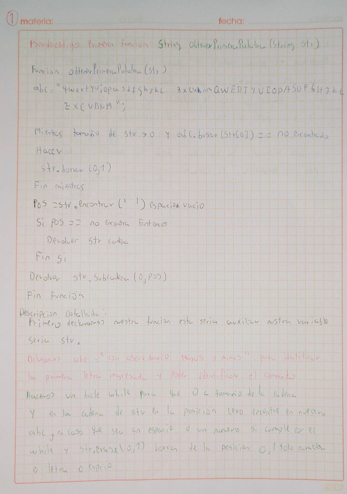
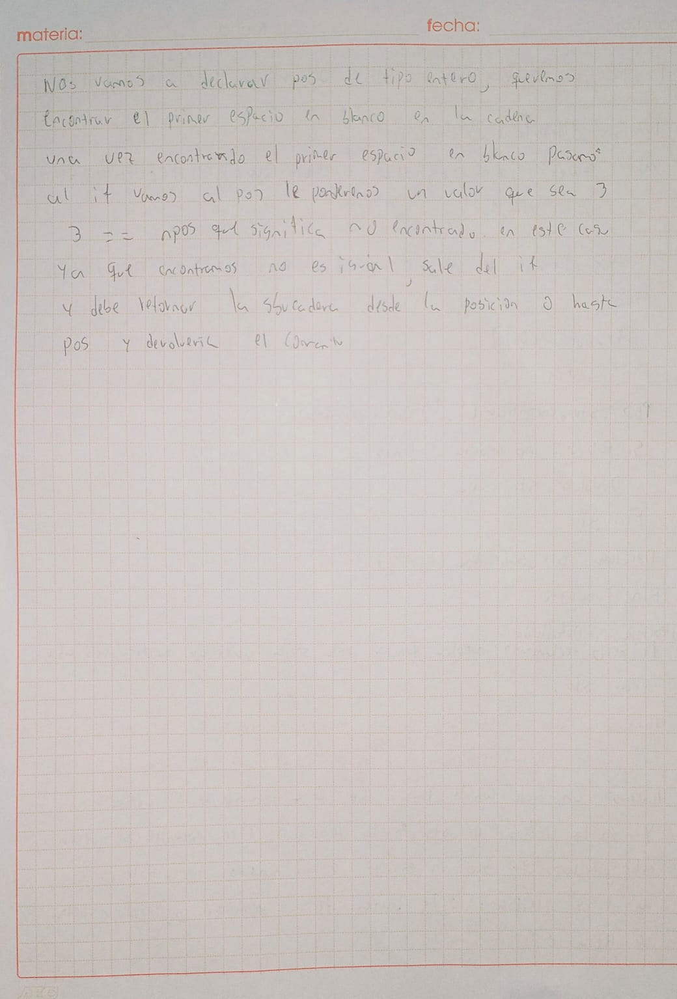
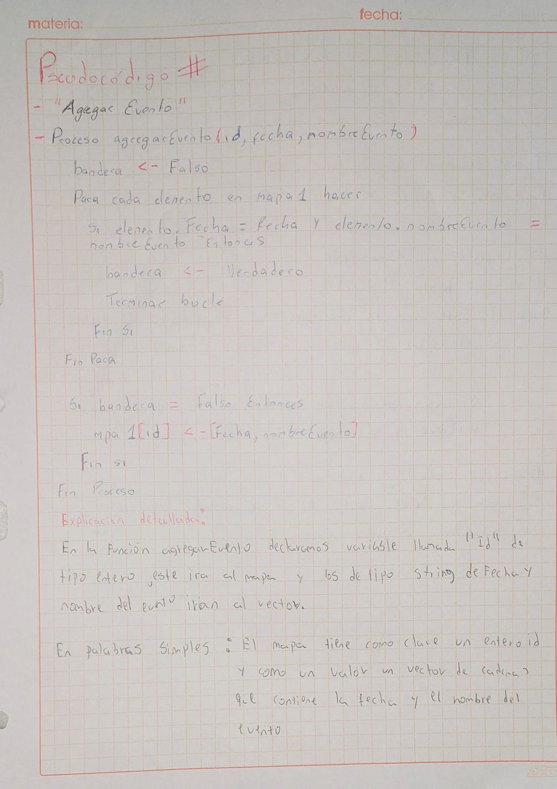

# EXAMEN-FINAL

1.  El Problema

En el contexto de nuestro proyecto, hemos sido asignados como desarrolladores de C++ en una empresa para crear un modelo de base de datos simple. El objetivo principal de este proyecto es implementar un sistema de gestión de eventos que permita almacenar, buscar y manipular datos de eventos asociados a fechas específicas. La importancia de este proyecto radica en la necesidad de una solución eficiente y manejable para registrar y consultar eventos, lo cual puede ser crucial para diversas aplicaciones, desde la gestión personal hasta el seguimiento de proyectos empresariales.

Problema Específico:

            El problema específico que estamos abordando es la falta de un sistema sencillo y eficiente para registrar y gestionar eventos asociados a fechas, con las siguientes características y requisitos:
1.	Almacenamiento de Pares Fecha-Evento: 
            Necesitamos un sistema que permita almacenar eventos asociados a fechas en el formato "AAAA-MM-DD". Un evento es una cadena de caracteres imprimibles que no contiene separadores como espacios o tabulaciones y no puede ser vacío.
2.	Interacción con el Usuario: 
            El sistema debe interactuar con el usuario a través de la entrada y salida estándar (stdin y stdout), permitiendo agregar, eliminar, buscar e imprimir eventos mediante comandos específicos.
3.	Manejo de Eventos Duplicados: 
            Si un evento ya existe en una fecha específica, no debe ser agregado nuevamente, evitando duplicados innecesarios.
4.	Manejo de Errores: 
            El sistema debe ser capaz de manejar errores de entrada de manera robusta, incluyendo comandos desconocidos y formatos de fecha incorrectos.

Impacto Esperado:

Este proyecto tiene el potencial de simplificar significativamente la gestión de eventos para los usuarios, permitiéndoles:
Registrar y recordar eventos importantes sin preocuparse por duplicados.

            Buscar rápidamente eventos asociados a fechas específicas.

            Eliminar eventos de manera eficiente, ya sea individualmente o todos los eventos de una fecha.

            Imprimir todos los eventos almacenados, organizados por fecha, para una fácil revisión.

            Al abordar estos problemas, esperamos proporcionar una solución eficiente y fácil de usar que mejore la productividad y la gestión del tiempo para los usuarios finales.

2. Explicacion de base de datos existentes, comparativa y justificacion de este nuevo desarrollo.

Explicación de bases de datos existentes, comparativa y justificación de este nuevo desarrollo
Bases de Datos Existentes

Existen varios sistemas de bases de datos ampliamente utilizados, cada uno con sus propias características y ventajas. Aquí vamos a comparar algunos de los más conocidos:

1.	MySQL:
            Ventajas: Es una base de datos relacional de código abierto muy popular. Es conocida por su rendimiento, confiabilidad y facilidad de uso.
            Desventajas: Puede ser excesivo para aplicaciones simples y su configuración inicial puede ser compleja para los principiantes.
2.	PostgreSQL:
            Ventajas: Otra base de datos relacional de código abierto que es conocida por su conformidad con los estándares y su extensibilidad.
            Desventajas: Puede ser más lenta que MySQL en ciertos casos y su configuración y mantenimiento pueden ser complicados.
3.	SQLite:
            Ventajas: Es una base de datos embebida que no requiere un servidor separado para operar. Es muy ligera y fácil de configurar.
            Desventajas: No es adecuada para aplicaciones que requieren un alto nivel de concurrente, y sus capacidades son limitadas en comparación con MySQL o PostgreSQL.
4.	MongoDB:
            Ventajas: Es una base de datos NoSQL que maneja datos en formato JSON. Es muy flexible y se adapta bien a los cambios en los requisitos de datos.
            Desventajas: Puede ser menos eficiente en términos de almacenamiento y rendimiento en comparación con las bases de datos relacionales.
5.	Oracle Database:
            Ventajas: Es una base de datos relacional comercial conocida por su alto rendimiento, escalabilidad y características avanzadas.
            Desventajas: Es costosa y su complejidad puede ser un impedimento para proyectos pequeños o desarrolladores individuales.

                                                        Comparativa
Facilidad de Uso: 
            SQLite es la más fácil de usar y configurar, seguida de MySQL. PostgreSQL y Oracle pueden ser más complejas.
Rendimiento: 
            MySQL y Oracle suelen ofrecer el mejor rendimiento para aplicaciones de gran escala. MongoDB es muy rápida para consultas de datos no estructurados.
Flexibilidad: 
            MongoDB ofrece la mayor flexibilidad en términos de esquema de datos. Las bases de datos relacionales (MySQL, PostgreSQL, Oracle) tienen esquemas rígidos.
Escalabilidad: 
            Oracle y MySQL son las mejores opciones para aplicaciones que requieren alta escalabilidad. SQLite no escala bien.
            Costo: SQLite y PostgreSQL son completamente gratuitas. MySQL es gratuita pero ofrece versiones comerciales. Oracle es costosa.

                                            Justificación del Nuevo Desarrollo
A pesar de la existencia de estos sistemas de bases de datos robustos y bien establecidos, hay varias razones por las que un nuevo desarrollo puede ser justificado:

1.	Simplicidad y Especificidad: 
            El problema específico que estamos abordando requiere una base de datos extremadamente simple y específica para el manejo de pares de datos (fecha, evento). Utilizar una base de datos completa como MySQL o PostgreSQL podría ser excesivo y añadir una complejidad innecesaria.
2.	Control Completo: 
            Desarrollar una base de datos a medida nos permite tener un control completo sobre su comportamiento, optimización y funcionalidades específicas necesarias para nuestro caso de uso.
3.	Ligereza: 
            Para aplicaciones pequeñas o integradas, una base de datos ligera y embebida es más adecuada. SQLite es una opción en este sentido, pero nuestra solución puede estar aún más ajustada a los requerimientos del proyecto.
4.	Educativo: 
            Desde una perspectiva educativa, desarrollar una base de datos desde cero proporciona una valiosa experiencia de aprendizaje sobre cómo funcionan internamente las bases de datos, lo que es invaluable para el crecimiento profesional.
5.	Optimización: 
            La capacidad de optimizar la base de datos para casos de uso específicos sin las limitaciones impuestas por un sistema de base de datos general.

3. Estructura del Repositorio

l30n3l/

    Program.cs
    README.md
    .gitignore
    bin/
        Debug/
        Release/
    obj/
        Debug/
        Release/
    src/
        MainProgram.cs
        Utilities.cs
    test/
        TestMainProgram.cs
        TestUtilities.cs
    docs/
        Manual.md
        Diagrams/
            flowchart.png
            flowchart_description.md
    lib/    
        library.dll
        dependency.dll

4. Pseudocodigo

4.1 Funcion obtener la Primera palabra

4.2 Eliminar Primera Palabra

4.3 Obtener La Fecha

4.4 Agregar Evento

5. Creditos - Las personas que contribuyeron al proyecto

Leonel Joe Jaldin Gutierrez
Leandro Joe Jaldin Gutierrez

6.Herramientas utilizadas

1.	https://www.youtube.com/watch?v=AEUPlMPFzDQ
    Como hacer un menu en C++ con do while (menú) - Fundamentos de Programación - 19

En este video me guie  como hacer un menú para nuestra base de datos y  nos ayuda a conectar nuestra variable comando con con los comandos que van apareciendo en nuestro menú como Add, Del, Find, Print y nuestra opción salir.

2.	https://www.youtube.com/watch?v=OxrBnQcDlf8
    Lenguaje C, programa para buscar una palabra en una frase, cadenas de caracteres, repetitivas

este video nos ayuda al Analís de la primera función de obtenerPrimeraPalabra en el conteo de las palabras desde cero hasta el primer espacio 

3.	https://www.youtube.com/watch?v=mtxeDGMzoLY
    C++ : What does string::npos mean in this code?

En este video nos ayuda a entender cual es el significado de string::npos significa no encontrado, significa que el elemnto no se encuentra en la poasicion del elemnto en la cadena
El retorno de string::npos significa que el elemnto no se encuentra en la cadena.

4.	https://www.youtube.com/watch?v=BqnXcsZ7-6w
    La constante estática de la cadena npos

En este video nos ayuda a la comprecion de string:: npos , string es la cadena y npos significa no encontrado
Si la cadena no es igual a npos entonces sale del while o del if y seguimos a delante.

5.	https://www.youtube.com/watch?v=Yibwb3n1vm0 
    Programa C++ para encontrar una subcadena en una cadena

Como el titulo del video lo dice nos da ejemplos de como encontrar la subcadena en el caso del comando Add fecha evento nostros queremos saber cual es la subcadena en este caso queremos saber el comando que el usuario esta usuando en este caso Add

6.	https://www.youtube.com/watch?v=3tSwqsFzxi0
   Mapas con Vectores en C++ | Tutoprogra
En este video nos ayuda poder declarar un mapa y dentro de este un vector
Y también podemos ver como acceder a la poscion del vector que esta dentro de un mapa en este caso seria  -> second de esta forma podemos acceder al vector.

7.	https://www.youtube.com/watch?v=w7OwilQ_3XM
   Tutorial sobre MAP en Lenguaje C++

Este video nos ayuda aver como podemos iterar en el mapa con el bucle for y sus condiciones que serian for(i = mapa1.begin(); i != mapa1.end(); ++i)
Y también podemos observar como acceder a sus posiciones con los poderosos first y second. 
